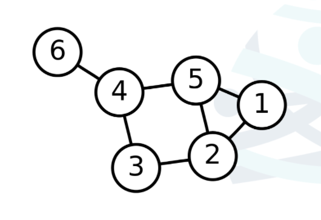
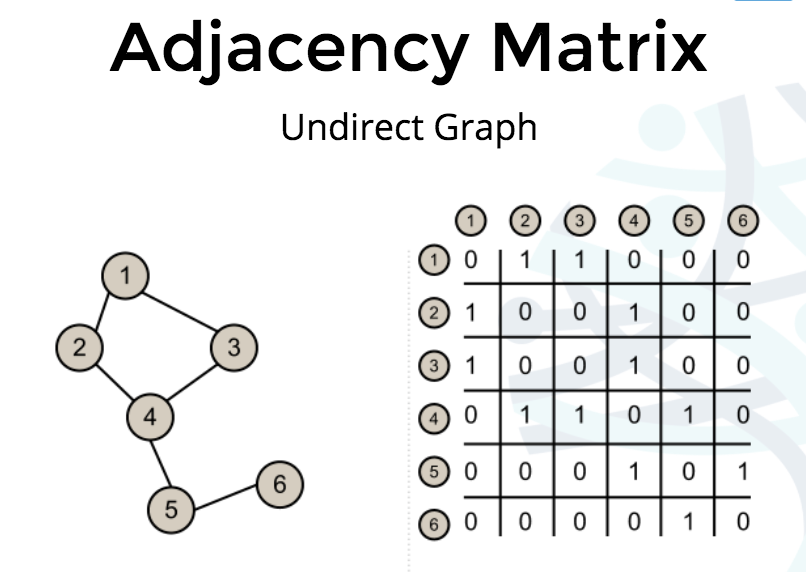
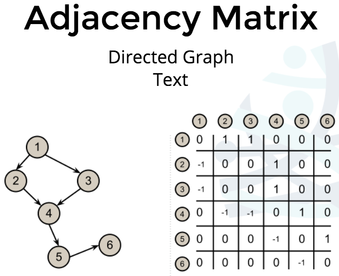
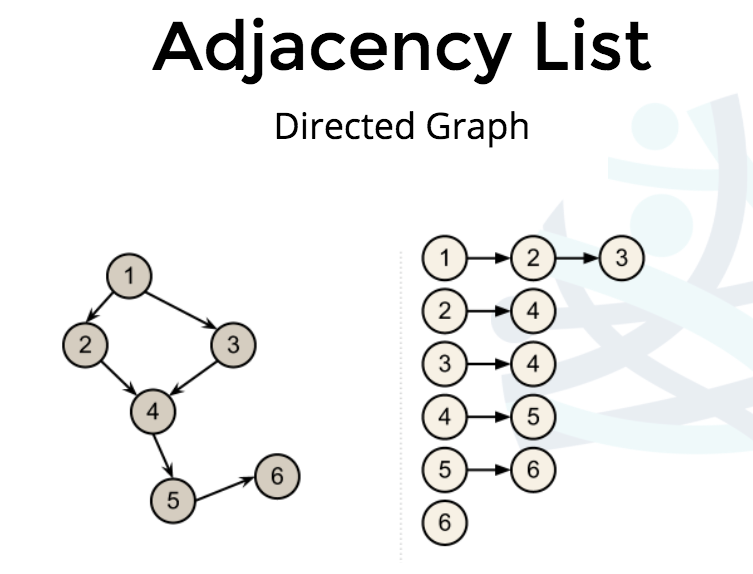

# Data Structures and Algorithms in JavaScript

Class notes for Frontend Masters
[Data Structures and Algorithms in JavaScript](https://frontendmasters.com/courses/data-structures-algorithms/)
course.

[Class Exercises Github](https://github.com/kuychaco/algoClass)

## Intro

* Combination of interview stuff and the most common topics taught in university
  CS courses.
* useless if you don't complete the exercises
* Not every data structure and algorithm ever invented
* not math heavy
* not the end, you need to keep practicing
* Content heavy
* Always do the exercises are looking at the answer before you solve it
* Pair with someone else taking the course - good to be able to talk with
  someone about it
* **Don't look at it and memorize the solution**
* Be ok with faling and don't give up

## Object Oriented JavaScript

### Pseudoclassical JavaScript

What goes through your mind that makes you nervous in an interview?

* **What's a data structure?** A structure to contain data. What would the
  interview look like without data? A container for data. We structure data
  because we need to do stuff with our data.

We're going to have a structure to our data structures, the structure is OOP.
We're going to use classes to make instances of our data structure. classes are
ways to create instances of your data structures.

### Defining a class

What is it? What does it have? What does it do?

Based around what's vs how in functional style.

```js
function Building(floors) {
  this.what = 'building';
  this.floors = floors;
}

var myHouse = new Building(3); // { floors: 3, what: 'building'}
```

The new keyword does some magic with the `this` keyword

```js
function Building(floors) {
  // var this = {}
  this.what = 'building';
  this.floors = floors;
  // return this;
}

var myHouse = new Building(3); // { floors: 3, what: 'building'}
```

`prototype` creates a function on each instance of building

```js
Building.prototype.countFloors = function() {
  console.log(this.floors, ' is the total floors');
};
```

calling `new Building(3)` will run everything in the body of the function. You
don't put the function inside of the constructor because it would create a
function each time an instance is created. `prototype` creates only one function
that can be called from each instance.

* There are several methods of creating classes in JavaScript. Pseudoclassical
  javascript is the standard type.

`this` is going to be the instance.

## Stacks & Queues

### Ingredients to Learn DS

```
1. Learn the concept
	- Draw it
	- Create the API/operation methods
2. Build the Data Structure
	- Pseudocode the implementation (if you want)
	- code the data structuref
3. utilize the data structure
	- put your data structure to work
	- pair it with an algorithm if needed
4. understand the data structure
	- What is the time complexity
	- How can you optimize it
```

### stacks

list, all you can do is push and pop. An example of a stack is our call stack.

One cube of the callStack is called the stack frame.

### stacks interface

easy because many of us are familiar with the interface

```
1. Constructor Function
	- storage
2. Methods
	- push(value) // adds value to the front, return size of stack
	- pop() // removes value from the front, returns value
	- size() // returns the size
```

### Queue

The first item in will be the first item out. adding in is called `enqueued`,
taking them off is called `dequeued`

Interface

```
1. Constructor Function
	- storage
2. Methods
	- enqueue(value) // adds to back, returns size
	- dequeue() // removes from front, resturns value
	- size() // returns size of queue
```

## Recursion

### Why recursion?

recursive functions, recursive, algorithms and recursive data structures.

* elegant solutions to keep your code D.R.Y.
* expected CS knowledge

### template for a recursive function

recipe

```
1. identify base case
2. identify recursive case
3. return where appropriate
4. write procedure
```

**memo or accumilator** – when you pass along track to trigger base case.

## Time Complexity

Intro to time complexity

### space vs time complexity

* Space Complexity - How much memory is used?
* Time Complexity - How many comparisons are made? - How many swaps are made?

with respect to input size and always assume worst case scenerio

We'd expect that the more data we have, the longer it will take

---

If we had to find find the lowest and highest price hotel from the following
data set

```js
var hotels = [
  {price: 200, brand: 'Estin'},
  {price: 50, brand: 'Best Eastern'},
  {price: 175, brand: 'Radishin'},
];
```

One approach would be to compare each price to every other price. You would be
running through the dataset twice. In the data set above you would be making
**9** comparisons. If there were five hotels you'd be making **25** comparisons.
This would be time complexity **n<sup>2</sup>**.

This is significant growth and this would be considered a slow algorithm.

Another approach would be to check for the maximum and minimum number.

|      | 200 | 50  | ... | 175 |
| ---- | --- | --- | --- | --- |
| max? | yes | no  | ... | no  |
| min? | no  | yes | ... | no  |

This would be 2 operations per hotel. This time complexity would be **2n**

If your data is sorted like –

```js
var hotels = [
  {price: 50, brand: 'Best Eastern'},
  {price: 175, brand: 'Radishin'},
  {price: 200, brand: 'Estin'},
];
```

You would only have to do **2** operations. This is called **constant time** or
as your input size grows it still remains 2, which is the fastest you could ever
have.

| Big-O, name                 | # of operations                 | Algorithm                        |
| --------------------------- | ------------------------------- | -------------------------------- |
| O(n<sup>2</sup>), quadratic | n<sup>2</sup>                   | compare all numbers              |
| O(n), linear                | 2n, (drop insignificant values) | find min and max numbers         |
| O(1), constant              | 3                               | Sorted list, find first and last |

**Fastest -> Slowest**

| Name     | constant | logarithmic | linear | quadratic        | exponential      |
| -------- | -------- | ----------- | ------ | ---------------- | ---------------- |
| Notation | O(1)     | O(logn)     | O(n)   | O(n<sup>2</sup>) | O(k<sup>n</sup>) |

Anything above linear would generally be considered a bad algorithm.

### Calculating time complexity

```js
arr.push(); //O(1)
arr.pop(); //O(1)
arr.unshift(); // O(n) <~~ shift array over n times to add a value to the beginning
```

Even though you have native methods you have to be mindful of their time
complexity.

**O(logn)** is any algorithm where you cut a data set in half to find your
solution (binary search).

**Space complexity**

Same concept applied to space you're taking up to solve a problem, like creating
a seperate array to store data. When your data set grows how much does the space
grow? Not as big as time complexity.

**Exercises**

```js
var countChars = function(str) {
  return str.length;
};
countChars('dance');
countChars('walk');
```

`O(1)` constant time because length is just a property lookup. The value is not
computed each time you call it. Anytime you're not calling a function with
parenthesis (`str.length` vs `str.length()`), it's just a property lookup and
it's O(1). In that way the details matter.

`myList.unshift();` is `O(n)` because it has to go through each item in the
array and move them down.

`.push()` is `O(1)` because it just has to put one on the end.

## Elementary Sorting

All the elementary sorting algorithms suck because they're slow, but probably
where you will start in your job interview.

### Bubble Sort

compares adjacent value and swaps them to put the higher one at the end. Highest
number bubbles to the top.

bubble sort sudo code

```
// sorted = false
// while !sorted
	// sorted = true
 	// for i loop 0 to n-2
 		// if A[i] > A[i + 1]
 			// swap
 			// sorted = false
```

### Stability

In sorting you also want to think about stability. Stability is when you
preserve the original order when some value is the same

|        |      |         |     |     |     |
| ------ | ---- | ------- | --- | --- | --- |
| Bike A | $600 | 20 lbs. |
| Bike B | $500 | 30 lbs. |
| Bike C | $500 | 35 lbs. |

bikes already sorted by weight. Then when you sort by weght.

|        |      |         |     |     |     |
| ------ | ---- | ------- | --- | --- | --- |
| Bike B | $500 | 30 lbs. |
| Bike C | $500 | 35 lbs. |
| Bike A | $600 | 20 lbs. |

bike c and bike b have the same price, so it maintains the original sort by
weight.

A sorting algorithm is adaptive if it becomes more effinient, i.e. if its
complexity is reduced.

### Selection sort

selects the smallest element in an array, pushes it into a new array. Selection
sort in place finds the largest number and swaps it to the end. Goes through the
array again finds the largest one and swaps it with the second to last item in
the array. [diagram](http://slides.com/bgando/sorting#/1/16)

### Insertion sort

selects the first item in the array and pushes it into a new array in sorted
order. Insertion sort in place

[diagram](http://slides.com/bgando/sorting#/1/19)

## Sorting Algorithms

### Merge Sort

Merge sort takes two sorted lists and merges them into one sorted list.
[diagram of concept](http://slides.com/bgando/sorting#/2/2)

```js
var x = [1, 4, 7, 8];
var y = [2, 5, 6, 8];
```

Them you compare the first number in each list and move the smaller of the two
into the new list

```js
var sorted = [1, 2, 4, 5, 6, 7, 8, 8];
```

The is linear time **O(n)**

### Merge Sort Pseudocode

```
- merge(L,R)
	- Lpointer = 0
	- Rpointer = 0
	- outputArr = []
	- Loop until
	- L.ln - 1 === Lpointer or R.ln - 1 === Rpointer

		- if L[Lpointer] < R[Rpointer]
			- push L[Lpointer] to output array
			- increment Lpointer
		- else
			- push R[Rpointer] to output array
			- increment Rpointer
		- if L[Lpointer] === L.length - 1
			- outputArr.push(R.slice(Rpointer))
		- if R[Rpointer] === R.length - 1
			- outputArr.push(L.slice(Lpointer))
```

[merge sort divide portion](http://slides.com/bgando/sorting#/2/4)
[Merge portion pseudocode](http://slides.com/bgando/sorting#/2/7)

**[My merge sort solution](https://codepen.io/wyattsweet/pen/bYzoBm?editors=0012)**

### Merge sort time complexity

Merge sort is **O(n \* (logn))**. logn is the recursive splitting and n is the
merge.

### Quick Sort

Steps for divide & conquer

* recognize the base case
* divide: break problem down during each call
* conquer: do work on each subset
* combine

quick sort is in place. All the action happens on the splitting.

**process**

**partition step**

vocab:

* Pivot Point: The element that will eventually be put into the correct index.

* Pivot location: The pointer that keeps track of where the list is less than on
  the left and greater than our pivot point on the right. Becomes equal to pivot
  point when sorted.

### Quick Sort partition Sudo Code

```
- partition(arr, lo, hi) // lo and hi === indecies
	- pivotLoc = lo
	- pivot = arr[hi]
	- loop from lo to hi
		- compare pivot to arr[pivotLoc]
		- if `arr[pivotLoc] > pivot`
			- increment pivotLoc
		- else
			- arr[pivotLoc] goes to temp var
			- previous slot to pivot goes to index IF previous slot is not arr[pivotLoc]
			- pivot moves to previous slot
	- TODO: recur
```

### recurssion sudo code

```
quickSort(arr, lo, hi) {
	if(lo === undefined) lo = 0
	if(hi === undefined) hi = arr.length - 1
}
```

## Trees and Searching

[slides](http://slides.com/bgando/trees-and-searching#/)

### Trees

Trees or n-ary trees start with a root node and each node can have `n` children.
The nodes on the bottom that don't have children are called leafs.

**Binary Tree** Same as n-ary tree plus each node can have a max of 2 children.

This is a data structure so you will use the sudo-classical pattern.

### tree interface

**constructor**

* storage
* root

methods:

* insert(key): Inserts a new key in the tree
* search(key): Searches for the key in the tree and returns true if it exists
  and false if it doesn't
* min/max: This returns the min or max value/key in the tree
* remove(key): this removes the key from the tree

### Linked Lists

A linked list is a simplified tree. A tree where each node only has one child
and has a pointer to the next node.

A node holds some type of data and a pointer to the next node.

### Linked List Interface

1. Constructor function
   * storage
   * head

* Methods - `addToTail(val)` adds node to tail - `.remove(node)` removes node
  from list & returns it

## Binary Trees

Binary search tree same as binary tree plus each node is comparable. Each node's
left subtree < parent value and right subtree > parent value

**Performance**

Sorted Array - fast value lookup by key but slow to insert of delete values
because existing values need to shift.

BST - usually fast for value lookup, inserting and deleting values. This Data
structure is flexible.

With binary search trees we are cutting the data structure in half, making it
`logn` time.

### in-order traversal

Traversal is any time you want to look at every node in your BST.

Three different traversals

* in-order
* preorder
* post order

This would be linear time, visiting each node once

**In-order traversal**


Goes from smallest to largest

**Pre-order traversal**


self, then left, then right

**Post-order traversal**


left, then right, then self

Depth first means the algorithm goes all the way down and then pops back up.

### Time complexity for a BST

insertion would be `O(logn)` – each time you're splitting the data set in half.
traversal would be `O(n)` linear time because you are always visiting one node.

### Deleting min/max node

## Graphs

A graph data structure has vertices connected by edges. Vertices are nodes on the graph.



- **Edges**: Represent the connection between 2 vertices
  - directed: Directed edges only go one way
  - undirected: undirected edges are unidirectional
- **Vertices**: Nodes in the graph
- **Path**: a sequence of connected vertices. A simple path has no repeated vertices. A simple path has no repeated vertices.
- **Cycles**: a path that is cyclical. An acyclic graph has no cycles

### Common Operations

* Add an edge
* Delete an edge
* Detecting an edge
* Finding the neighbors of a vertex
* Finding a path between two vertices

### Representing Graphs

With trees we've represented them as nested objects, but graphs will be represented more abstractly. Optimize for specific use cases. 

#### Adjacency Matrix

A matrix is how we represent something on a 2D plane, such as a game board, cheese, a 2d array.

```js
// 2 x 2 matrix
const 2x2 = [[], []]
```

Use an **adjacency matrix** to represent the relationship between vertices.

Undirected Version


This can be thought of as a 2-dimensional array. If there is a relationship between the 2 vertices then the value is 1, otherwise it's 0.

Directed Version


Adjacency Matrix - Weighted Directed Graph, measures at each vertices the cost from getting from one vertex to another.

#### Adjacency List

Similar to a collection of linked lists.



The top line is saying from 1 you can go to 2 or 3. From 2 you can only go to 4.

## Depth and Bredth-first Search

### Graph traversing and depth-first search

When you go down to the last element first, then come back to the beginning

You want to mark vertices when traversing as one of the following –

1. Explored: If you have looked down one edge of a vertex

2. Visited

3. Undiscovered
