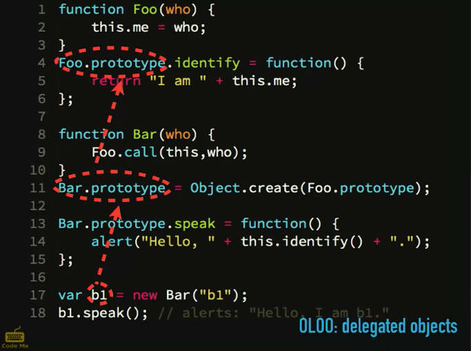

# Deep JavaScript Foundations

## Scope

### Compiling Function Scope

Shadowing – Have the same variable name declared in 2 different scopes within the same program. Once you shadow at compile time, then at runtime you can not access the variable within the lexical scope.

```js
var foo = "bar";
function bar() {
	var foo = "baz";
}
```
### Scope of Execution Example*

LHS reference is known as a target assignment
RHS reference is everything that's not an LHS

global scope automatically will declare a value if you don't use a variable assignment keyword

```js

function bar() {
	function baz {
		foo = 'heelllooo' // <~~ This get put in the global scope
	}
}
```
**undefined** - been declared but atm doesn't have a value

**undeclared** - never been declared in any scope

### Scope Review
Lexical scope is fixed and does not change

```js
var foo = function bar() {
	// function identifier
}

bar() // Error! bar doesn't get set in global scope. Only a reference to it within the scope of the function.

foo() // works!

```

### Named Function Expressions

anonomous function expression or function declaration

```js
var clickHandler = function() {}
```

named function expression

```js
var keyHandler = function keyHandler() {

}
```

### Lexical Scope

```js
function foo() {
	var bar = 'bar'
	
	function baz() {
		console.log(bar) // Lexical
	}
}

foo();
```

**theoretical** dynamic scoping

```js
function foo() {
	console.log(bar) // dynamic
}

function baz() {
 var bar = 'bar'
 foo();
}

baz();
```

Walks up with call stack to find the function.

### IIFE pattern

IIFE - immediately invoked function expression

```js
var foo = 'foo'

(function IIFE(bar) {
	var foo = 'foo2'
	console.log(foo) // => foo2
})(foo)

console.log(foo) // => foo
```

### Block scoping

iife is a heavy handed way of creating block scoping

 `let` keyword
 
 ```js
 
function diff(x,y) {
  if (x > y) {
    let tmp = x // create tmp variable that only exists in the if block. Creating 
    x = y
    y = temp
  }
  console.log(tmp) // <~ refError, tmp only exists in the if block
  return y - x
}
 ```
A lot of people taking `let` to the extreme and replacing `var` with `let` when it's not necissary. Critically think about where `let` would be useful.

A good place for the let is on the for loop.

```js

for (let i = 0; i < whatever; i++) {}

```

that way you can't access i outside of the loop rather than var which is scoped to the function.

### const

a constant is a variable that can not be reassigned, not a variable that can't be changed.

const is block scoped

### Hoisting

```js

a; // <~ undefined because var a below gets hosited to the top of the scope
b;
var a = 2;
var b = 3;
```
Function expressions do not hoist because they are variable assignments. 

`let` does not hoist. 

**function declaration** is –
```js
function foo() {

}
```

function declarations do hoist

a function expression is –

```js
const foo = function() {

}
```

function expressions do not hoist.

## Closure

**Closure** – When a function "remembers" its lexical scope even when the function is executed outside that lexical scope.

Closure Example –

```js

function foo() {
  var bar = "bar";

  function baz() {
    console.log(bar);
  }

  bam(baz);
}

function bam(baz) {
  baz(); // "bar"
}

foo();

```

In this example `baz()` is executed within the scope of `bam`, which is outside the lexical scope of `foo`. Yet it still has access to `bar` which exists within it's lexical scope of `foo`. It is said that `baz` closes around `foo`. Calling `baz` on line 7 wouldn't be considered closure, that's just lexical scope.

Another way of transporting functions around is by returning functions –

```js

function foo() {
  var bar = "bar";

  return function() {
    console.log(bar);
  }
}

function bam() {
  foo()(); // "bar"
}

bam();

```

In this example – 

```js
for (var i = 0; i < 5; i++) {
  setTimeout(function() {
    console.log("i: " + i);
  }, i*1000);
}

// 666666
```

six 6s are returned because the function inside `setTimeout` is closing around the same variable `i`, so there is only one `i` which gets closed around 6 times.

If you do this –

```js
for (let i = 0; i < 5; i++) {
  setTimeout(function() {
    console.log("i: " + i);
  }, i*1000);
}

// 123456
```

using `let` will create a new variable on each iteration, resulting in `123456` being printed out into the console. There is a new `i` being created each time.

If you have a language where functions are first class citizens (they are values that can be passed around) and you have a lexically scoped system, you have to have closure. It's a by-product of those 2 things being true.

### Module Pattern

Encapsulation means hiding of information which isn't necissary to be seen by the outside world. If a method or variable isn't needed, you shouldn't expose it to the rest of the code base. Encapsulation take advantage of function scope to hid things which aren't necissary.

```js
var foo = {
  o: { bar: "bar" },
  bar() {
    console.log(this.o.bar);
  }
};

foo.bar();

```

In this example there is no way to keep people from using `o` or `bar`. The **classic module pattern** would use an IFFY to hid the private parts. If we wanted `o` in the example above to be private it would look something like this using the classic module pattern –

```js

var foo = (function() {
  var o = { bar: "bar" };

  return {
    bar: function(){
      console.log(o.bar);
    }
  }
})()

foo.bar();

```

The only thing that would exist in the public api is that which exists within the return object, you couldn't reference `foo.o`. This has been a predominate pattern in JS for a long time. 

This pattern is all about helping you design your software so the proper seperation of responsibilities are in place. If you have a group of functions responsible for the dom stuff and another set of functions responsible for the data model, having all of those conflated together in the global namespace is not great.

There are 2 characteristics that need to be present when using this module pattern –
1. There must be an outer enclosing scope, most likely function, which runs at least once
2. There needs to be at least one internal function that returns and has closure over the internal state.

As of es6 we got dedicated syntax for this module pattern. With this syntax **the file is the module**. Makes it impossible to package multiple files inside of a module.

```js
// foo.js
var o = { bar: "bar" };
export function bar() {
  return o.bar;
}

// bar.js
import { bar } from "foo.js";
bar(); // "bar"
```
This view of having multiple files loaded in antithetical to web performance and the rule that you shouldn't load multiple files, but TC39 is expecting modules to roll out at the same time as HTTP2 which loads everything over a persistant socket connection, similar to web sockets. There's one connection made between client and server.

Modules are by default singletons. If you `import { bar } from 'blah.js'` 15 times it will only create `blah.js` one time then create 15 refernce copies to the same method. Just importing it will not create a new instance.

Node.js doesn't support the new module import pattern and as of now they can't support the old require style along with this new style.
You can author in ES6 modules and transpile to requireJS style.

Primary benefit of module pattern is to encapsulate and hid things we don't want to expose.
One downside is testability, white box testing is hard because you can't test a function if it's hidden.
Black box testers don't think of units as functions, a unit is more one piece of business logic, multiple function with one public api.

## Object-Orienting

Section will address –

- this
- prototypes
- class keyword
- "Inheritance" vs "Behavior Delegation" (OO vs OLOO - objects linked to other objects)


### this

Every function (except arrow functions), while executing, has a reference to its current execution context called this.

JavaScript's version of "dynamic scope" is this. Lexical scope is fixed and predictable while `this` is dynamic and flexible.

The only way to determine what `this` points to and that is by asking, How was the function called? It doesn't matter where it was written or where it was called.

**4 Rules for How a function can be called**

```js
function foo() {
  console.log(this.bar)
}

var bar = "bar1"
var o2 = { bar: "bar2", foo }
var o3 = { bar: "bar3", foo }

foo() // bar1
o2.foo() // bar2
o3.foo() // bar3
```

1. default binding rule – When `foo()` is following the **default rule** which say when a function doesn't match any of the other rules this defaults to the global object which is why it prints the bar from the global scope. It strict mode this throws an error because this would be undefined because you never really want this to refer to the global object.

2. Implicit binding rule – If at the call site there is a context object such as with `o2.foo()` this implicitly says, "call foo in the context of o2".

3. explicit binding rule

```js
function foo() {
  console.log(this.bar)
}

var bar = "bar1"
var obj = { bar: "bar2" }

foo() // bar1
foo.call(obj) // bar2
foo.apply(obj)
```

with `foo.call(obj)` we are explicitly saying use obj as the `this` context

**Losing your this binding** If you make a this aware function that gets passed as a callback to another utility, its callsight is going to throw away the previous binding. 

4. Hard binding - 

```js
function foo() {
  console.log(this.bar)
}

var obj = { bar: "bar" }
var obj2 = { bar: "bar2" }

var orig = foo

foo = function() { orig.call(obj) } // this pattern is hard binding the this reference
// foo is hard coding the .call into it to say use obj regardless of how you're called

foo(); // bar 
foo.call(obj2); // bar
```
There's a utility build into JS to make these hard bound functions `.bind`

```js
function foo(baz,bam) {
  console.log(this.bar + ' ' + baz + ' ' + bam);
}

var obj = { bar: "bar" };
foo = foo.bind(obj,'baz');

foo('bam')
```
`foo = foo.bind(obj,'baz');` hard binds `this` to be `obj`. `foo` will always use `obj` as its this

You gain predictability but you loose flexibility. There is a tension between flexibility and predictability, never a right answer.

Up to the developer to decide if you need predictability or flexibility. You would never use one in every scenerio.

### The new keyword

The new keyword actually has nothing to do with creating instances of classes.

```js
function foo() {
  this.baz = "baz";
  console.log(this.bar + " " + baz);
}

var bar = "bar";
var baz = new foo();
```
The 4 things the new keyword does when put in front of a function call
1. creates a brand new empty object
2. newly created object gets linked to another object
3. newly created object gets passed in as `this` to the function call
4. implies a `return this` if you didn't explicitly return

`new` is doing most of the work here.
`new` is called a constructor call. Any random function with the new keyword in from of it (unoffical term)

**4 rules for determining what `this` is**

1. Was the function called with the `this` keyword?
2. Is the function called by `call()` or `apply()`? Note: `bind()` uses `apply()` under the covers
3. Is the function called on a context obj?
4. DEFAULT: global object (except strict mode) 

`new` will override a hardbound function

**Arrow Functions** do not have a this keyword. `this` inside of a arrow function has no special meaning it behaves with lexical this behavior.

## Prototype

### Prototypes Introduction

Objects are built by constructor calls, a function with the new keyword
Metaphor for OOP is a blueprint for a building and the actual building itself.
The constructor is the blueprint and the instance is the actual building. This is more of a copy. If you take out a wall from the blueprint it will still exist in the building that has already been created. If you knock out window in the building, it doesn't remove it from the blueprint. 

Inheritance a typical metaphor is DNA. When you have a child, they inherit your DNA. That is a copy relationship. If you loose your hair, your child doesn't automatically loose their hair.
The same is true in inhetance in coding. If your instance did inherit a change that happened after it was initiated, that would be called **retro-active inheritance**.

JavaScript doesn't do copying, **A constructor in JavaScript makes an object linked-to its own prototype**. This is the difference from how C++ and Java create classes vs. the system in JavaScript called classes actually works.

### Explaining ProtoTypes

```js
function Foo(who) {
  this.me = who;
}

Foo.prototype.identify = function() {
  return 'I am ' + this.me;
}

var a1 = new Foo('a1');
var a2 = new Foo('a2');

a2.speak = function() {
  alert('hello ' + this.indentify)
}

a1.constructor === Foo;
a1.constructor === a2.constructor;
a1.__proto__ === Foo.prototype;
a1.__proto__ === a2.__proto__;
```

**Line 0 environment – stuff that exists before our program even runs**
A function called object and an object are created
This object, the most important in JavaScript doesn't have a good name so, we refer to it by the property which links to it called `.prototype`. The object function links to the object via prototype.

There is another linkage (property) that goes the other way, from the object to the function, which is called `constructor`, which is confusing because the object is not constructed from the function. In this context `constructor` has no special meaning.

When `function Foo(who)` is created a similar linkage between function and object is created. In addition there is a internal linkage created between the original object and the new object created with `Foo` called the **prototype chain**.

When you create an instance with `var a1 = new Foo('a1')` it follows the 4 rules when a new keyword is in front of a function and creates a new object assign to a variable `a1`.

When you call `a1.constructor`, `a1` doesn't have a constructor property on it, so the default behavior is to follow the **prototype chain** up to the next object. In this case `a1`s prototype chain points to `Foo`s object, therefore the constructor of `Foo`s prototype points to Foo and `a1.constructor === Foo`

The way to use the direct linkage of one object to another is with `__proto__` or dunder proto. Which was introduced as a temporary hack but needed to get added as standard because people started using it.


### Prototype: Linkages
In OOP to overwrite a parent class you would **shadow** or overwrite that method in the child class and to call the parent class you can call `super`. This pattern falls apart in JavaScript and doesn't work when you try to put classes on it. Part of the problem with this traditional OO class pattern is that no matter how far up the prototype chain you go, `this` remains rooted to the call site.

`Object.create()` executes the first 2 steps of the `new` keyword

1. creates a new object
2. Links it to another object

```js
function Foo(who) {
  this.me = who
}

Foo.prototype.identify = function() {
  return "I am " + this.me
}

function Bar(who) {
  Foo.call(this,who)
}

// This links Bar.prototype to Foo.prototype
// One way you can kind of simulate a class system
Bar.prototype = Object.create(Foo.prototype)

Bar.prototype.speak = function() {
  alert("Hello, " + this.identify() + ".")
}

var b1 = new Bar("b1")
var b2 = new Bar("b2")

b1.speak() // alerts: Hello, I am b1
b2.speak() // alerts: Hello, I am b2
```
**Review**

1. What is a constructor call? *A function with the new keyword in front of it*
2. What is `[[Prototype]]` and where does it come from? 
*It's a linkage from one object to another, it's created at the time the prototype object is created*
3. How does [[Prototype]] (prototype chain) affect the behavior of an object?
*If you call a method on an object and it doesn't exist, it will delegate up the chain*
4. How do we find out where an object's [[Prototype]] point to?

* `__proto__` dunder proto
* `.getPrototypeOf()`
*  `.constructor.prototype`

### ES6 Class

To write the previous `Foo` example as a class would look like this –

```js
class Foo {
  constructor(who) {
    this.me = who;
  }

  identify() {
    return "I am " + this.me;
  }
}

var a1 = new Foo('a1');
var a2 = new Foo('a2');

a1.identify();
a2.identify();

```

syntactically nicer, but just using prototypes under the covers. Same limitations. Syntax hides problems. Designed to codify the static nature of inheritance vs the dynamic nature of the prototype system.

inheritance also looks nicer thanks to the `extends` keyword

```js
class Bar extends Foo {
  speak() {
    alert('Hello, ' + this.identify() + '.'); // <~ goes up the prototype chain
  }
}
```

You get the `super` keyword to allow shadowing

```js
class Foo {
  constructor(who) {
    this.me = who;
  }

  identify() {
    return "I am " + this.me;
  }
}

class Bar extends Foo {
  identify() {
    alert('Hello, ' + super.identify() + '.');
  }
}

```
They didn't change the system, just added a lot of "duct tape". They are designed to keep you within the lines, if you push the limits classes will fall apart.

Certain new things were added to classes, not completely syntactic sugar.

static methods (constructor inheritance): The classes themselves have inheritance not just the instances. You never had a `Bar` that delegated to `Foo`.

```js
class Foo {
  static hello() {
    return 'hello';
  }
}

class Bar extends Foo {
  speak() {
    ...
  }
}

Bar.hello(); // Calling Hello() directly from Bar not an instance
```

### Class Caution

6 bits of caution o be aware of when using classes.

You can't mix classes and objects together, it's all or nothing.

```js
var Foo = {

}

class Bar extends Foo { // <~ error!

}
```

Can't call the class or do any of the dynamic this binding

```js
class Foo {
  
}

class Bar {

}

Foo(); // <~ error
```

Can't reference the `this` keyword until after you've referenced the super function.

`this` keyword is dynamic sensitive but `super` is not, this is only because of performance.

You can add a function after the fact but that function can not use the super keyword 

```js
class A {
  one() { ... }
  two() { ... }
}

class B extends A {  }

B.prototype.foo = function() { // <~ ok to add a function
  this.one(); // works! 
  super.two() // syntax error!
}
```

This is also because super is statically bound

You can use super in methods, but it has to be the concise method syntax -

```js
class A {
  one() { ... }
  two() { ... }
}

var B = {
  __proto__: A.prototype, // <~ clever!
  foo() {
    super.one(); // works
  }
  bar: function() {
    super.two(); // syntax error
  }
}
```

class does have some nice syntax affordances, but there are more than enough corner cases

### Clearing Up Inheritance

Javascript does use concepts from object oriented but it is not a class based OOP language in the traditional sense. You can do object oriented like things with it, but really it follows prototypal inheritance. Another Design pattern which simplifies what we do **behavior delegation**.

OOLO - objects link to other objects

 – 

The above can all be written without all the complexity –


The above is OOLO style. Less complex and use OOP without the classes. It's a simpler style and also a simpler mental model.

Delegation is a third style of designing software, along with functional style and object oriented. In this system you have to move away from parent to child and think peer to peer.


Example of 2 seperate objects which share functions and properties. At the call site we decide to mix these 2 objects together. Call authenticate on line 18 which is in the other object. It uses `this` which is passed in from `LoginFormController`.

One of the concrete benefits is that these are more testable. They stay independent which makes them easier to test rather than trying to test 2 modules which are hard coded to each other. Pieces are easier to test because they are independent.


**Javascript is a delegation system not a class based system. You can use it for OOP but it is not a class based OOP language in the traditional sense. You can do object oriented like things with it, but really it follows prototypal inheritance.**

1. How is JS `[[Prototype]]` chain not like traditional/classical inheritance?
Rather than copying stuff down, we have live links up the prototype chain.

## Types, Coercion
fun fact: JavaScript was supposed to be designed to appeal to Java developers. Has a lot more in common with scheme than Java.

Type - The set of intrinsic behaviors we can expect given any particular value.

In a statically typed language (c++, java) types are a description for what can go in a variable.
In dynamic languages (js) we focus on the value itself having a type not the container (variable).

* primitive types
* Natives
* Coercion
* Equality

### Primitive Types

* undefined
* string
* number
* boolean
* object
* symbol - added in es6
* function - really a subtype of the object, referred to as a callable object
* null

```js
typeof foo; // "undefined" 
typeof "foo" // "string"
typeof 123 // "number"
typeof true // "boolean"
typeof {a: 1} // "object"
typeof function test(arg) { return arg } // "function"
typeof null // "object"...wat!? This is a bug
```
`typeof` if asking what is the type of the value that is in a variable, JavaScript allows you the freedom to hold any type in any variable. `typeof` if the only mechanism in the language that could get a variable that hasn't been declared and will return `undefined`. `typeof` always 

**"There's nothing more permanent than a temporary hack"**

- NaN ('not a number')
- Infinity
- null - value and a type
- undefined (void)
- +0, -0

Ieee754 compliant features

`NaN` anytime you try to take a value and convert it to a number. When that conversion fails it tells you this is a invalid number.

```js
var a = "a" / 2; // can coerce "a" to a number, so conversion fails
a // NaN
typeof a // "number"
NaN === Nan // false
isNaN(a) // true
isNaN("foo") // true! Another bug.
Number.isNan("foo") // false, polyfill
```
If you do division, and it failed to produce a number don't want to change to a different type.
Implicit conversion was an attempt to make the language approachable/user friendly
`NaN` really means invalid number.

## Negative Zero

```js
var foo = 0 / -3;
foo === -0 // true
foo === 0 // true
0 === -0 // true
```
The reason these work are because the language is trying to hid the fact there is a negative zero.

Testing for negative 0

```js
function isNeg0(x) {
  return x === 0 && (1/x) === -Infinity
}
ifNeg0(0 / -3) // true
ifNeg0(0 / 3) // false
```

ES6 Object.is
```js
Object.is("foo", NaN) // false
Object.is(NaN, NaN) // true
Object.is(0, -0) // false
Object.is(-0, -0) // true
```
Another way to test for Negative 0 or `NaN`

```js
var baz = 2
typeof baz // 'number'
var baz; // There's no re-declaring of variables in JavaScript, this doesn't do anything to baz. Compiler sees this as no-op situation
typeof baz // 'number'

baz = 'baz' * 3
baz // NaN
typeof baz // 'number'

baz = 1 / 0
baz // Infinity
typeof baz // 'number'
```

### Natives

* String
* Number
* Boolean
* Function
* Object
* Array
* RegExp
* Date
* Error

Not really native types, or native objects even they are functions and all functions are objects. Most of the time you'd want to call these as normal functions, so maybe Native Functions is most appropriate label.

Some require the `new` keyword and some don't, there's inconsistencies.

**These are objects and not primitives. Native type `String` is different than the primitive string.**

```js
var foo = new String('foo')
foo; // 'foo'
typeof foo // 'object'

foo = String('foo')
typeof foo // 'string'
```
`new String` is a wrapper object around the primitive string `foo` that was passed in. When called without the `new` keyword `String` coerces the value passed in to being the primitive type. `String`, `Number`, and `Boolean` behave this way. There's no real reason to use the `new` keyword

```js
var foo;
foo = new Array(1,2,3) // not preferred
foo = [1,2,3] // preferred!
new Array(42) // doesn't return [42], it returns an array presized to a length of 42, which is confusing! wtf.

foo = new Object() // not preferred
foo = { a:1, b:2 } // preferred, better optimized by the JavaScript engine. Declarative and clear.
```

```js
var foo
foo = new RegExp("a*b", "g"); // can use if you need part of your pattern to be dynamic
foo = /a*b/g // preferrable for non-dynamic use cases
foo = new Data() // there is no Date literal, have to use constructor form. 
Date.now() // preferrable if you need a timestamp for this current moment
// Really a date library is the way to go.
// Moment.js is the best, but it's large and adds bloat to your project
```

## Coercion

Abstract operations - 

`ToString` a internal function or abstract operation that is called when the JS engine wants to convert a value to a string. For example it would convert `null` to `'null'`

The default `toString` method is a bit more complicated.

`toString` return the following

```js
[] //=> ""
[1,2,3] //=> "1,2,3"
[null,undefined] //=> "," ???
{} //=> "[object Object]"
```

`ToNumber` abstract operation

```js
"" //=> 0 converting an empty string (no value) to 0 a value is a serious error made early on. Root cause of every coercion bug in JavaScript
"   " //=> 0
"0" //=> 0
"-0" //=> -0
```

Booleans

```js
false 0
true 1
null 0 // Why does this become 0 too?
undefined NaN // Null becomes 0 but undefined NaN??
```

To understand booleans need to understand **falsy** and **truthy**. These words are kind of made up and don't actually exist in the spec.
Falsy - If you have a value and you try to produce a boolean out of it, it will convert to false. Falsy values are 0, null, NaN, false, undefined. Everything else produces **true**.

**These rules only apply if the ToBoolean operation is actually invoked.** There are several places that appear it's being invoked but it's not.

Coercion is a dynamic languages way of expressing how values convert from one type to another. All languages have some method for type conversion.

What patterns of coercion are useful and which should we avoid

Two groups: Explicit and Implicit, not saying explicit good and implicit is bad.
There's a lot of subjectivity here.

Explicit: it's obvious from the code that you're doing it

First case: Going between string and number. Most obvious way would be `parseInt(foo,10)`

```js
var foo = "123"
var baz = parseInt(foo,10)
baz // 123
```

Argues parsing is not coercing. Parsing is looking for chars from left to right and looking for characters that you're looking to match.
`parseInt` technically not coercion. Decide what you're doing and use the right tool for the right job and use it the correct way.

```js
baz = Number(foo)
baz // 123
```
The `Number` native function takes whatever you give it coerces it to a number. Good way to do explicit coercion.

```js
baz = +foo
baz // 123
```
`baz = +foo` most common way to coerce to a number, used a lot in open source. This operator calls `Number` behind the scenes. Does not seem as explicit or self intuitive. Should have conversations about your styleguides and this should be included. idiomatic style, when faced with a problem, how do we want to solve that?

Number to string

```js
baz = 456
foo = baz.toString()
foo // "4,5,6"
```

`toString` is pretty explicit.

You can't call a method against a primitive value you call methods against objects. How was `toString` called against a number? There is a term for this called **boxing** JavaScript will automatically coerce a primitive to its object wrapper counterpart so you can call a method against it. This is an implicit coercion.

```js
foo = String(baz) // pretty explicit
foo // "456"
```

### Going from any value type to a boolean

```js
var foo = "123"
var baz = Boolean(foo) // Explicit!
baz // true

baz = !!foo // double negate, veerrryy common
baz // true // pretty explicit

// explicityly implicit! implicit because we have to do an implicit coercion on `foo` to do the test
// definitely not an ideal way
baz = foo ? true : false // This is a javaism
baz // true
```

**Code that you don't understand, is code you can't trust**

### Date to Number and ~

You can coerce a date to it's unixs timestamp by running `+ new Date` or `+ new Date()`
You can also call `Date.now()`, which is most ideal, no need for coercion.

`~` operator is the equivalent of `-(N + 1)`

```js
var foo = 'foo'
if (~foo.indexOf('f')) { console.log('f exists') }
```
The `~foo.indexOf('f')` results in false `-(-1 + 1) = -0`

Best way now is to use `Array.includes` (new as of ES2016)

**The best, most readable code is code that doesn't have to be read**
Meaning code that is instantly recognizable, hids unimportant detail.

### Booleans

implicit coercion - anytime you pass a value into an `if` statement, automatically coerces it.

```js
var foo = 123
if (foo) {...} // implicit coercion
foo = 0
if (foo == false) { // true

}
```
what's happening is that `==` prefers comparing numbers, so it turns false into 0 and compares the 2 zeros.

```js
foo = 0
var baz = foo || 'foo'
baz // 'foo'
```
`||` is more like a selection operator they coerce the first value to a boolean then select a value based on the result. If `foo` is true, it will return foo

```js
var foo = '123'
foo == true // false
```
`==` doesn't do a boolean coercion, it coerces both of the values to numbers. '123' get coerced to 1 and false to 0, so it compares `1 == 0`

NEVER compare `==` true and false

### Implicit vs Explicit Coercion

Avoid double equals if either value could be `true` or `false`. Can either value ever be `[]`, `''`, or `0`.

### Double vs Triple Equal

Coercive equality `==` vs `===`

`==` allows coercion: Checks type, if type is the same return the result of performing strict equality comparison. `null` and `undefined` are treated the same. 

`===` disallows coercion

Good use cases for `==`

```js
var foo = '3'
if (foo === 3 || foo === '3') {
  console.log('in here')
}

// if you don't know whether foo is a string or number
// the above could be written with double equals like so

if (foo == 3) { console.log('up in here, up in here') }
```

### `==` or `===` performance

Honestly doesn't matter. If types are the same, they behave the exact same.
`===` is about 30% faster when `==` has to do coercion.

They're also not the same -

```js
// not equivalent
x == y
x === y

// equivalent
x == y
(x === y || x === z)
```
