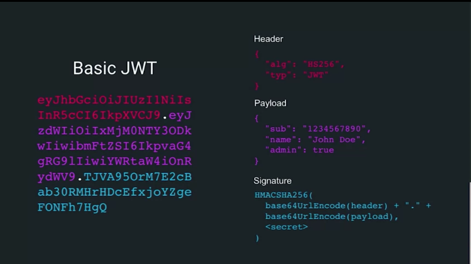

# JSON Web Tokens

## Basics

An open standard which is a method to securely communicate between two computers

Digitally signed and compact way to exchange information.

client makes an **assertion** to the backend and provides JWT as proof.

Great method for doing stateless authentication. Meaning client and server don't need to know too much about each other, other than how to prove their identities to each other.

3 parts to a BASIC JWT

Any attempt to change the token will invalidate it

**JWT Header**
* JSON obj describes token
* Min should include the token type and signing algorithm
* signing algorithm necessary for token to be verified
* HS256 - synmetric way of signing token
* RS256 asymetric

**JWT Token**
This is where we make assertions

**JWT Signature**
BASE64 encode the header and payload then run them through a hashing algorithm with a secret key.

Signature is used as a means to digitally sign the token so that its validity can be verified later.

## JSON Web Tokens and single page apps

In traditional authentication, the server is doing all the heavy lifting

## JWT Authentication

Secret key which is used to sign token, saved on server and used to verify the token when it comes back, usually done with middleware.
