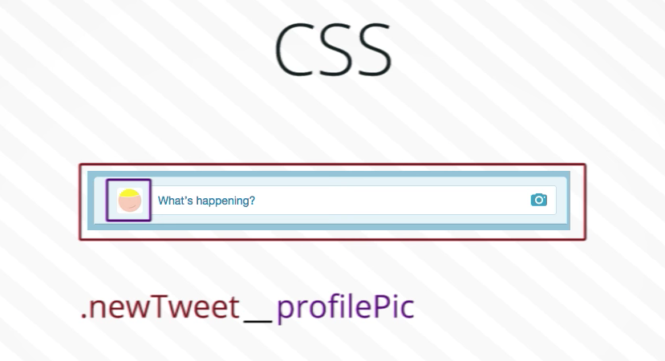

# BEM (Block Element Modifier)

## Basics

A naming convention for designing UIs which encourages you to think about your UI in terms of reusable blocks.

**Block** is a independent entity within your layout.

**Element** pieces within the block, which only make sense while contained within the block itself.

Every block and element should have a keyword that identifies it.

* Block names must be unique.
* Element names must be unique within a block.
* Blocks can be nested forming a "BEM" tree.
* You shouldn't use an html element in css selectors such as `.rightSidebar img`.


In bem you want to use CSS selectors that avoid cascading. You use the naming convention `.blockName__elementName`



You would never use id selectors, only class selectors because blocks can be repeated multiple times on a page.

**Modifiers** are properties of a block or element which changes the look or behavior of a block or element. Several modifiers can be used on one block.

Lets say you have a sidebar block `.sidebarRight` and it contains a search bar element `.sidebarRight__searchBar`. If you wanted to create a version of the search bar with an aqua background it would look something like this

```css
.sidebarRight__searchBar--aquaBackground {
  background: aqua;
}
```

In BEM you use the `--` to signal a modifier.

This naming convention extends beyond just CSS. If a version of the block also relies on some JavaScript, we would describe its appearance and behavior in all technologies being used: HTML, CSS and JavaScript. This is called **multilingualism**.


BEM selectors are structured as follows - `.blockName__elementName--modifier`


## Resources

- [Introduction to BEM](https://www.youtube.com/watch?v=IO-4Z32O--c)
