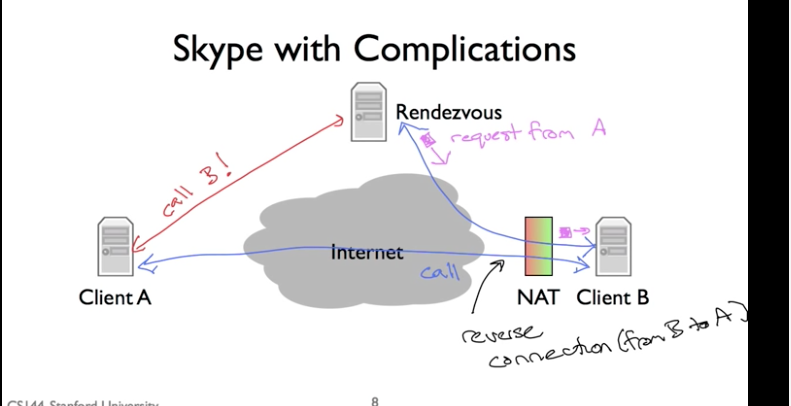

# Introduction to Computer Networking

## Unit 1: The Internet and IP

### [1.1 A day in the life of an application](https://lagunita.stanford.edu/courses/Engineering/Networking-SP/SelfPaced/courseware/ac9d1eef5aaa4bb5bcfe4d42f51f0f5b/489652e64f114cda8b3e0a514ff7e498/)

connectivity - two computers can connect and exchange data

Networked applications
- read write data over network
- most common communication model used is a bidirectional stream of bytes
  - One side reads what another writes

#### Basic client server model
- The web uses HTTP to communicate
- In HTTP a client opens a connection to a server and sends commands to it, such as GET to request a page
- Response has a number code associated with it, such as `200` ok.

#### BitTorrent Example
bittorrent breaks files up into something called "pieces".
collection of clients is called "swarms".
Download the torrent file, which has info on the file and who the tracker is
Tracker keeps track of who's a member of the swarm.
You have a dense graph of clients connected to each other

#### Skype
client a "caller" opens connection to client b.
Both are clients requesting data from each other.

This happens with something called a NAT
If you're behind a NAT you can open connections to the internet, but other nodes on the internet can't easily open connections to you.

Uses something called a rendezvous server.
Client B opens a connection to the rendezvous server and client A makes a call to the rendezvous server.
If client B accepts, it will open connection to client A.
Client A couldn't open the connection because B was behind the NAT, so the rendezvous server which B is connected to, tells B that A wants to make a connection. If they accept B opens a connection to client A. This is called a **reverse connection** because B is opening a connection to A.

If client A and client B are behind a NAT they have to communicate through a relay.

#### overview: Application Communication

most common communication model of networked applications is bidirectional, reliable byte stream. Allows to communications to exchange data.

### [1.2 The 4 Layer Internet Model](https://lagunita.stanford.edu/courses/Engineering/Networking-SP/SelfPaced/courseware/ac9d1eef5aaa4bb5bcfe4d42f51f0f5b/09b18b9bd046403a93c85b82044ea603/)

Describes hierarchy of operations that make up the internet. Layers are there to help the end host communicate reliably.

Application – This can be http, bit-torrent. bi-directional reliable byte stream between two applications. They use application-specific semantics such as HTTP.

Transport – Guarantees all data packets get delivered in order and uncorrupted. Most common is TCP (transmission control protocol). TCP provides a service to an application which guarantees correct, in-order delivery of data running on top of the network layer. UDP is an alternative to TCP, but offers no delivery guarantees.

Network – networks job is to deliver packets end to end. Network layer packets are called **Data Grams**. Data and header with to and from address. Network layer hands the packet to the link layer. Link layer provides a service of transmiting data gram over one link. Data gram goes from network layer, over a link to a router where it gets passed back up to the network and repeats until it hits the destination. Network layer doesn't concern with how the data is sent, that's the link layers job.

Network layer is "special", on the internet you must use the internet protocol (IP). IP makes a best effort attempt to deliver our datagrams to the other end, but it's not guaranteed. IP datagrams can get lost, be delivered out of order, or be corrupt.

Link – bottom layer. Data is delivered hop by hop through links until it reaches its final destination. Data is delivered in packets. Packet contains data and a header which says where we want the data to be delivered, where it came from, etc. Link layers job is to carry the data over one link at a time. Ethernet and wifi are 2 examples of link layers.

### [1.3 The IP Service Model](https://lagunita.stanford.edu/courses/Engineering/Networking-SP/SelfPaced/courseware/ac9d1eef5aaa4bb5bcfe4d42f51f0f5b/c15c7835c22e4f83a36c86b7ec2b4bbb/)

Section is focused on the network layer and the service provided by the IP (internet protocol).

#### The IP Service Model

Datagram - Individual routed packets. Hop-by-hop routing. IP is a datagram service.
Datagram is a individual packet of data that gets routed through the network. Datagram contains a header with `IP DA` DA stands for destination address. At each router the `IP DA` determines how the gram will get routed. Also in the header is `IP SA` (source address) which tells the receiver where to route the response.

Data grams are routed hop by hop from the `IP SA` through routers to the `IP DA`. Routers contains a forwarding table which tells it where to send the packets next. It uses the DA to index into its own forwarding table which tells it where to send it next hop along the path towards its final destination.

It's very similar to how letters are sent through USPS. The move hop by hop to the final destination, neither sender nor receiver need to know how to get it to its final destination. 

Unreliable - IP is unreliable, makes no promise it will be delivered. 

Best effort - It wont deliver datagrams arbitrarily. It will only drop the datagram for a good reason. a faulty routing table might cause a packet to be sent to the wrong address or be duplicated by mistake. IP datagram service very similar to post office. Makes no promise they will be delivered on time or in any specific order. IP is a simple/minimal services.

connectionless - No per-flow state. Packets might be mis-sequenced. IP maintains no state about the communication path.

#### Why is the IP service so simple?

Why is it so simple when it's the foundation of the entire internet. Why not make IP more reliable?

- Keep network simple, bumb, minimal. Belived this would allow for packets to be delivered very quickly with a lower cost to build and maintain. 
- The end-to-end principle: Where possible, implement features in the end hosts. Place as much intelligence as possible in the end points the SA and DA. One of the most important principles for designing communication systems.
- Allows a variety of reliable (or unreliable) services to be built on top. Let's the application choose the reliability guarantees that it needs.
- Works over any link layer: IP makes very few assumptions about the link layer below.

#### The IP Service Model (Details)

IP provides a few other services beyond the unreliable, best effort datagram service

Bare minimum vs too bare that it doesn't work at all

5 features of IP service

- Tries to prevent packets looping forever. Likely to happen when forwarding tables are changing. Catches and deletes packets that appear to be caught in a loop using the `TTL` field in the datagram header. It starts out at a number and decremented at each router it passes through. If it's 0, IP concludes it must be stuck in a loop and the router drops the datagram. 

- Will fragment packets if they are too long. Most links have a limit on how big the packets can be, Ethernet's limit is 1500 MB. A datagram may need to go over a link with a lower limit. In this case, the router will fragment the gram into 2 smaller datagrams. IP provides header to help end host reassemble the data. 
- Uses a header checksum to reduce chances of delivering datagram to wrong destination.
- Allow for new versions. Two versions of IP in use today. Currently IPv4 with 32 bit address. We are running out of IPv4 addresses so there is a gradual transition to IPv^ with 128 bit addresses.
- Allows for new fields to be added to the datagram header.

#### IPv4 Datagram header

- Destination IP Address
- Source IP Address
- Protocol ID: Tells us what's inside the data field. Allows destination address to demultiplex arriving data, sending them to correct code to process the packet. If it has a 6, it would know the data contains a TCP segment and would safely pass datagram to TCP code. There 149 different protocol IDs representing different transport protocols.
- Version: Which version of IP we're using
- Total packet Length: Up to 64kb including the header and data.
- Time to live "TTL": The field that prevents datagrams from living in the network forever, never ending loop. Required to be decremented by each router.
- Packet ID, Flags and Fragment offset: When a packet is too long for the link it is about to be sent on. These fields help routers defragment IP packets into smaller self contained datagrams if need be.
- Type of Service: Hint to routers about how important this packet is.
- Header length: How big the header is
- Checksum: calculated over whole header, in case header is corrupted, prevents the packet from getting delivered to the wrong address.

#### Summary

IP is used every time we send and receive datagrams. Main transfer protocol used on the internet.
IP provides a deliberately simple service.

### [1.4 A Day in the Life of a Packet](https://lagunita.stanford.edu/courses/Engineering/Networking-SP/SelfPaced/courseware/ac9d1eef5aaa4bb5bcfe4d42f51f0f5b/d38948f20a2249508e3fc8c675b2738c/?child=first)

Application layer delivers a stream of data. The transport layer takes the stream, segments the data and reliably delivers these packets.

#### TCP Byte Stream

Most web traffic goes over TCP (transport control protocol).
The server listens for a connection request. To open a connection, the client sends a connection request the server responds to.
This message take 3 messages called the **3-way handshake**.

1. client sends synchronize "syn" message
- The server resonds with a **synchronize and acknowledge "syn/ack"** message.
- Client responds with **acknowledge "ack" message**.

The network layer is responsible for delivering packets to computers. The transport layer is responsible for delivering data to applications.

Two numbers are required for the transport layer.
1. IP Address, which the network layer uses to deliver data to computers
- TCP Port, which says which application to deliver the data to. Web servers typically run on port 80.

On  a wifi network, the first hop is wireless to the wifi access point.
Routers knows where to route package on each hop using a **forwarding table**. IP address patterns and the link to send across for each pattern.
In a forwarding table, there is a default route where it sends packets which don't match any of the other routes.

You can use `traceroute -w 1 URL` to see the hops that a request takes to reach its destination
You can use Wireshark to see the stream of packets using an application called Wireshark.

### [1.5 The Principle of Packet Switching](https://lagunita.stanford.edu/courses/Engineering/Networking-SP/SelfPaced/courseware/ac9d1eef5aaa4bb5bcfe4d42f51f0f5b/044d0bb484224000b85c71caa82b1f4a/)
